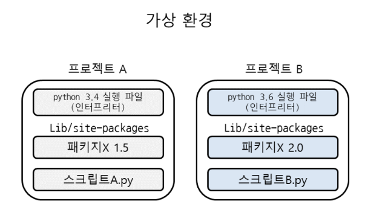
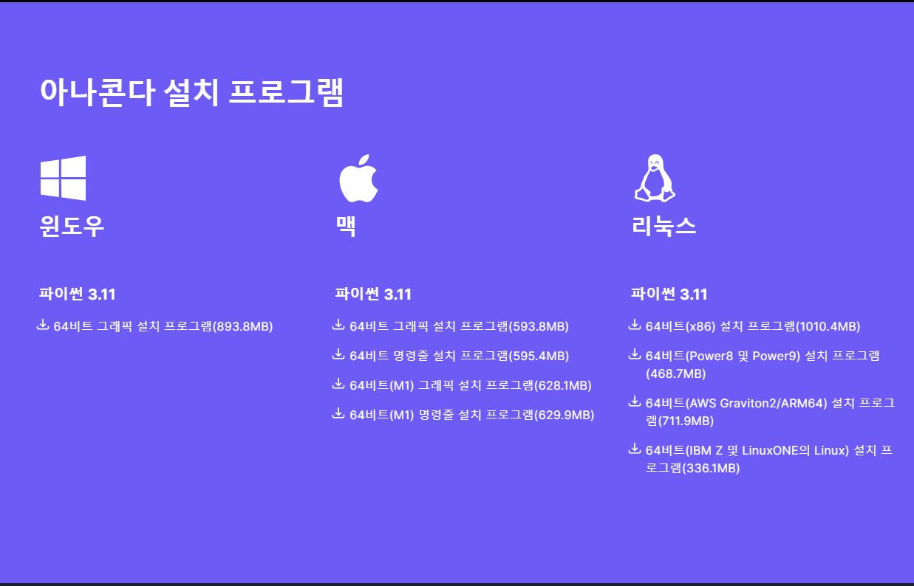
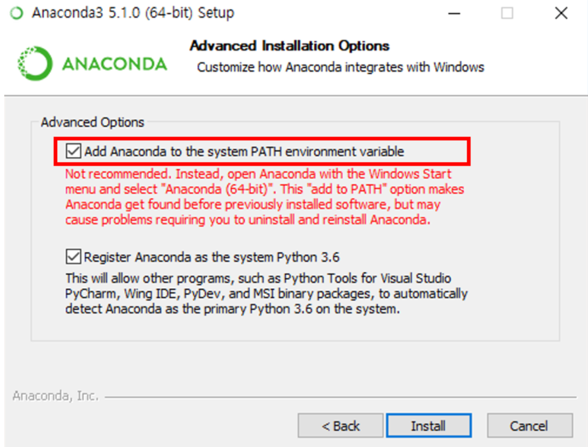
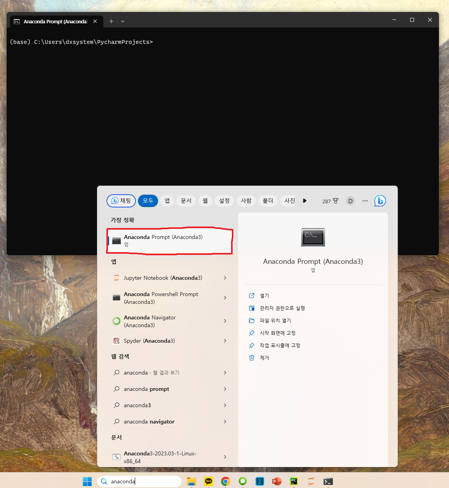
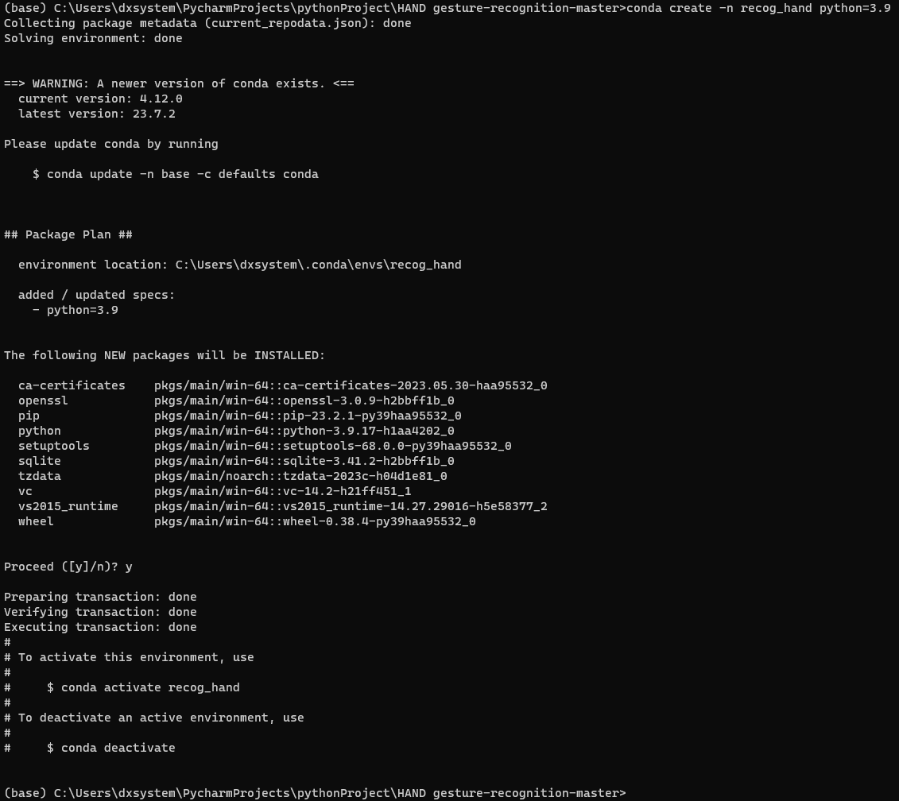

# Hand Gesture-recognition
## 1. 아나콘다란?
 - 파이썬을 활용해 여러 츠로젝트를 진행함.
 - 프로젝트를 하기 위해 파이썬을 설치하고 패키지를 Pip 혹은 Conda를 통해 다운 받음.
 - 하지만 프로젝트 별로 필요로 하는 파이썬 버전과 패키지 버전이 각각 다를 수 있음.
 - 이를 해결하기 위해 가상환경을 사용하며, 가상환경을 만들어 파이썬과 패키지를 독립적으로 관리할 수 있게 해줌.

## 2. 아나콘다 설치
https://www.anaconda.com/download

 - 위 링크를 접속하여 맨 밑으로 스크롤하면 다음과 같음.

 - 여기서 윈도우쪽 파이썬을 선택하여 설치를 진행함.
 - 이 후, 저장 라이선스 동의와 아나콘다 설치 경로를 정하고 계속을 눌러줌.

 - 이 부분은 Add Anaconda to the system PATH enviroment variable 은 아나콘다를 시스템 환경 변수에 등록하겠다는 것으로 꼭 체크해야 함.

   * path 설정을 하지 않으면 파이썬 인터프리터를 선택할 때, 매번 아나콘다 설치 폴더로 찾아가야하는 번거로움이 있음.
   * path 설정 시 컴퓨터가 자동으로 아나콘다의 설치 위치를 인식하기 때문에 쉽게 인터프리터 등을 설정할 수 있음.

## 3. 가상환경 세팅
 - 검색에서 "anaconda"를 검색하여 Prompt 열기

 - 해당 프로젝트 폴더 생성
 - cd 명령어를 통해 해당 프로젝트 폴더로 이동
 - "conda create -n 가상환경 이름 python=파이썬 버전" 명령어를 통해 가상환경 생성함.
   * pyhton 버전은 3.11.1 or 3.11.3

 - 설치 후 가상환경 활성화
   * 가상환경 활성화: conda activate 가상환경명
   * 가상환경 비활성화: conda deactivate

 - 라이브러리 설치
   * pip install tensorflow
   * pip install matplotlib
   * pip install scikit-learn
   * pip install mediapipe --user
   * pip install jupyter

## 4. 프로젝트 진행
 - 데이터 세트 수집 코드
   * 수집 코드의 경우 해당 경로에 파이참으로 파일을 만들어서 진행

 - 학습 코드
   * 학습 코드의 경우 과정을 보기 위해 가상환경 내 jupyter를 실행하여 코드 작성할 예정
   * jupyter-notebook 작성 후 실행

 - 테스트 코드
   * 테스트 코드도 동일하게 해당 경로에 파이참으로 파일을 만들어서 진행
  
 - 혹시 CUDA 관련 에러 메시지 발견 시 https://developer.nvidia.com/cuda-11.0-download-archive?target_os=Windows&target_arch=x86_64&target_version=10 해당 링크에서 파일 다운로드하여 설치 진행

