# opencv
 - OpenSource + ComputerVision 라이브러리임.

 - 영상처리를 하는 프로그램을 만들 때 꼭 필요한 라이브러리임.

 - 장점
   * 영상처리를 아주 쉽게 할 수 있음.
 

 - C++, Python 버전 등이 있음.

 - 앞으로 진행사항
   * 웹캠을 활용하요 진행
   * 가상환경에서 Opencv를 설치해 진행할 예정임.
   * 가상환경에 설치하는 이유는 원본 파이썬에 영향을 주지 않으므로 다양한 라이브러리를 설치할 수 있음.

---
### Python 설치
1. 링크 접속: https://www.python.org/downloads/

2. 파이썬 최신버전 설치

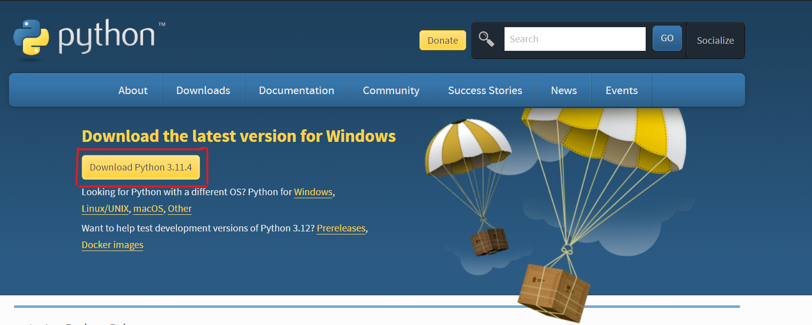

3. 파이썬 설치 프로그램 실행 후 Install Now 클릭

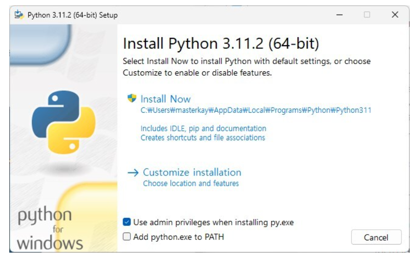

4. 고급옵션 설정은 설치 경로를 설정하고 환경변수 체크하고 인스톨하면 설치 완료

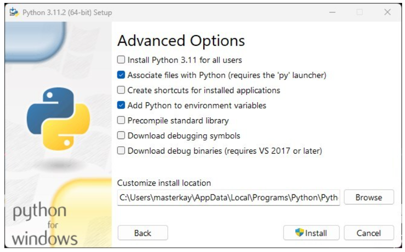

5. 설치 확인
 - 하단 검색에 cmd 작성 후 명령 프롬프트 실행 후 python --version 확인
 - python 작성 후 파이썬 실행
 - print('Hello World') 실행하여 정상적으로 작동하는지 확인

---

### 파이참 설치
1. 링크 접속: https://www.jetbrains.com/ko-kr/pycharm/download/#section=windows

2. community 버전 다운로드

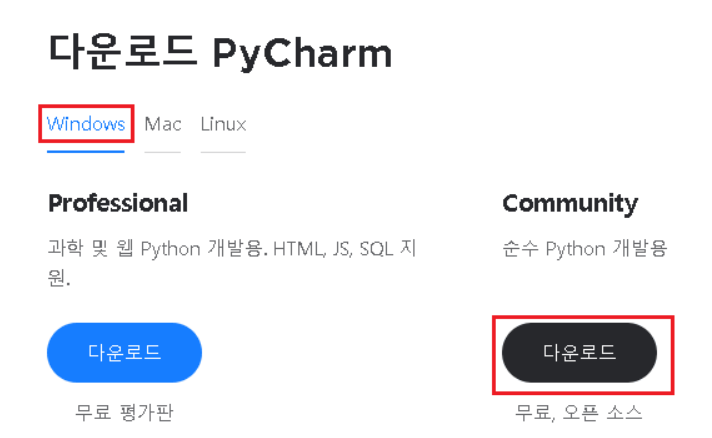

3. 설치 완료 후 실행

4. 'Next' - 'Next' 클릭

5. 파이참 설치 구성요소 설정

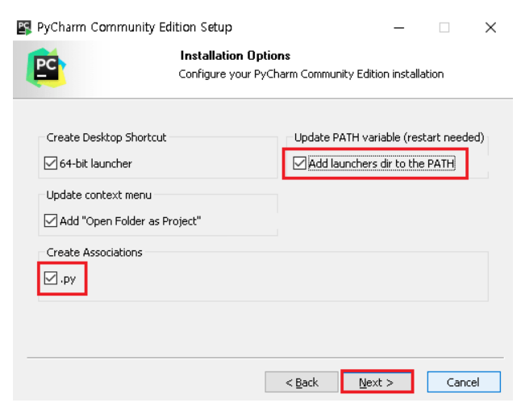

 - Create Desktop Shortcut: 바탕화면에 Pycharm IDE 바로가기 생성
 - Update context menu: PC 내에 있는 임의의 폴더를 마우스 오른쪽 버튼으로 클릭하고 pycharm에서 프로젝트로 선택한 폴더를 열 수 있는 옵션
 - Create Associations: pycharm IDE에서 .py 확장자 파일을 열 수 있게 해주는 옵션
 - Update PATH vaiable(restart): 명령 프롬프트에서 Pycharm에 직접 접근할 수 있게 해주는 옵션

6. Install 진행

7. 파이썬 인터프리터 설정
 - 새 프로젝트 클릭 후 프로젝트 위치 지정 및 이전 구성 인터프리터 추가 클릭

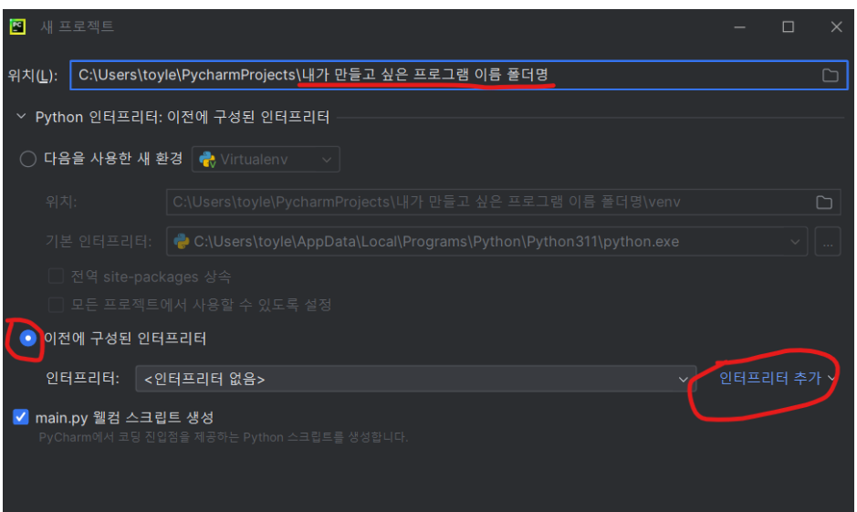

8. 로컬 인터프리터 추가

9. 파이썬 경로 지정

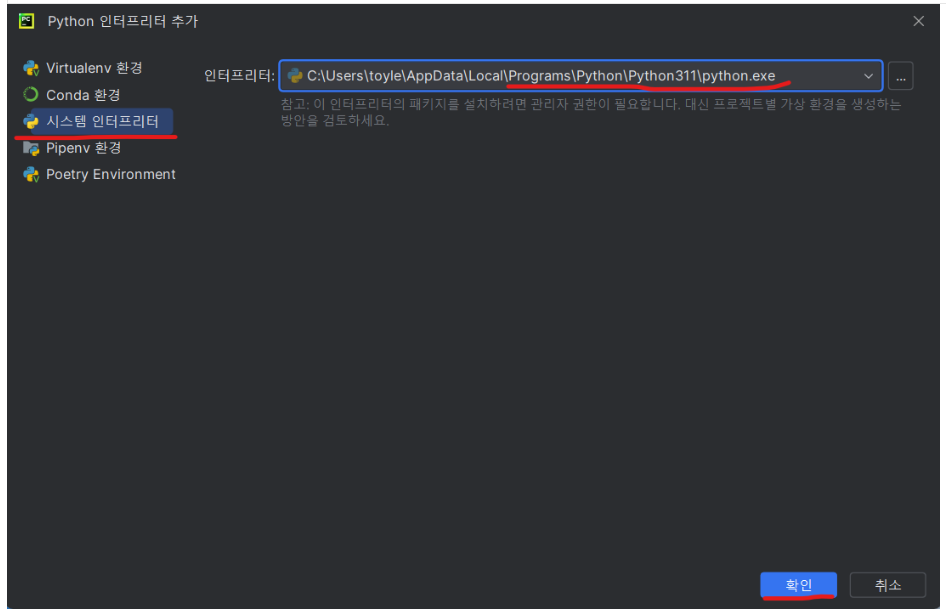

10. 최종 생성

---
### 파이참 한글 세팅
1. 설치 후 기본 화면에서 Plugins 클릭 후 korean 작성 후 install 진행

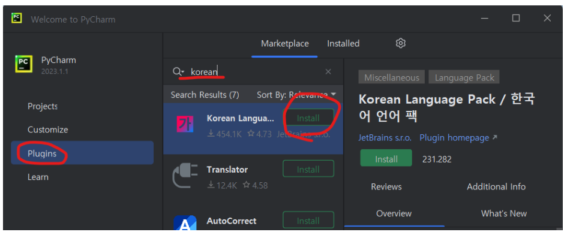

2. 인스톨 완료 후 Restart IDE 클릭 후 Restart 진행

---

### 가상환경 만드는 법(Pycharm)
1. 파일 -> 세팅 -> 인터프리터 열기

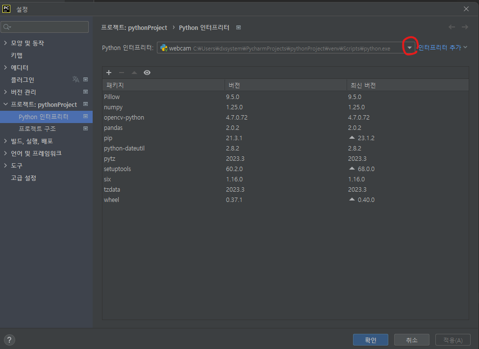

2. 위의 그림과 같이 빨간색 동그라미를 클릭한 후 모두 표시 클릭

3. 빨간색 동그라미 안에 + 모양을 선택

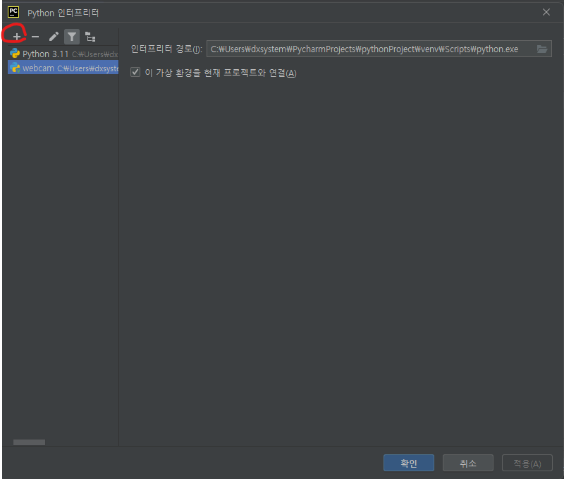

4. 확인 누르고 이전 창에서 만든 가상환경을 선택하여 확인

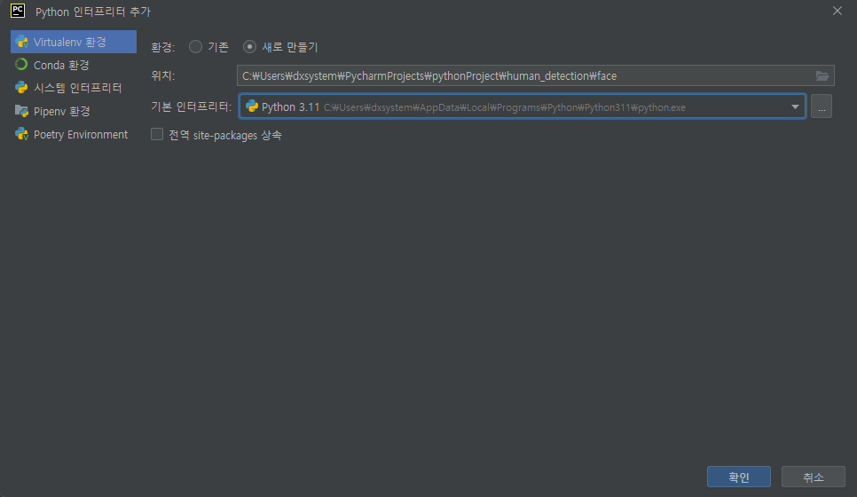

---
### 개발 환경 설정
- pip install pandas

- pip install numpy

- pip install opencv-python

- pip install opencv-contrib-python

- pip install pillow

- pip install cmake

- pip install dlib

#### * dlib 에러나는 경우
1. 아래의 링크로 들어가 Build Tool 다운로드하기

https://visualstudio.microsoft.com/ko/visual-cpp-build-tools/

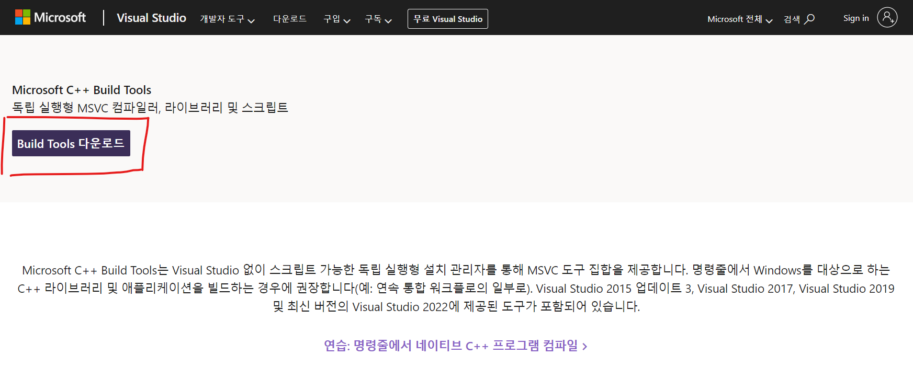

2. 설치 파일을 클릭하여 C++를 사용한 데스크톱 개발을 선택 후 설치 진행

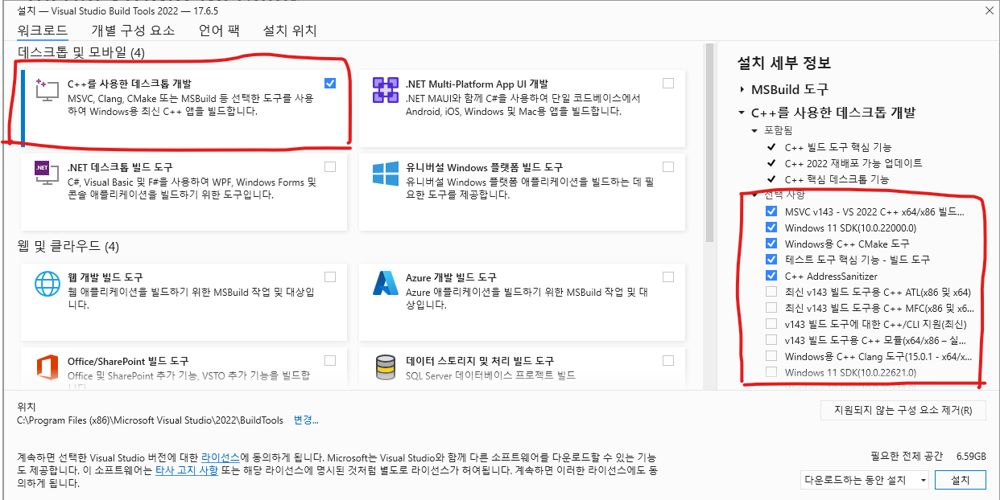